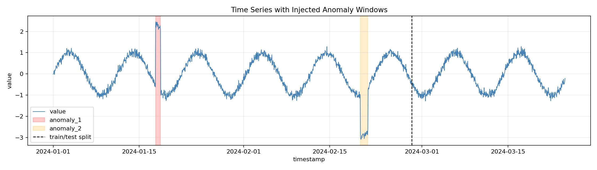
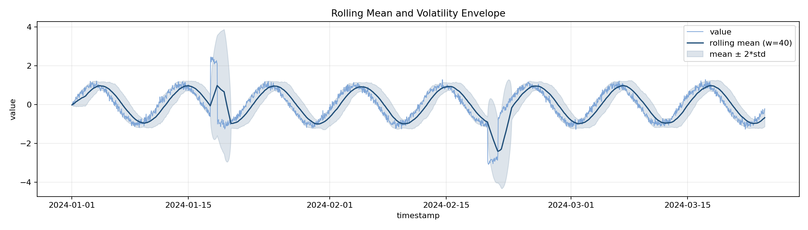
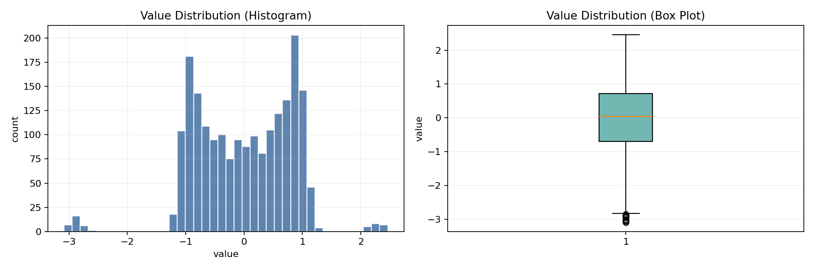

# Real-Time Industrial Anomaly Detection (Orion ML)

This repo provides a starting point for building a streaming anomaly detection system using **Orion ML** on time-series sensor data.

## Dataset

The project includes:

- an extracted NAB-style dataset at `Dataset/archive/` (real benchmark-style series)
- a generated synthetic dataset at `data/synthetic_machine_failure.csv` (default **10 000** hourly points, **mixed regimes**: sine, trend, random walk, dual seasonality)
- optional extra single-pattern CSVs when using `--also` (see below)

All series use the format:

`timestamp,value`

Run:

```powershell
python make_synthetic_data.py --outdir "data"
```

More points / other shapes:

```powershell
python make_synthetic_data.py --outdir "data" --n 20000 --pattern mixed_regimes
python make_synthetic_data.py --outdir "data" --also "sine_noise,linear_trend,random_walk,dual_seasonal,stepwise"
```

`--pattern` can be `sine_noise`, `linear_trend`, `random_walk`, `dual_seasonal`, `stepwise`, or `mixed_regimes` (default). Anomaly windows scale with `--n` unless you pass `--anom1-start` / `--anom2-start` explicitly.

## EDA and Plots

Generate EDA summary + meaningful plots:

```powershell
.\.venv310\Scripts\python src/eda_.py --csv "data/synthetic_machine_failure.csv" --meta "data/synthetic_machine_failure_meta.json" --out "data/eda_summary.json" --plots-dir "data/plots"
```

### 1) Time Series with Injected Anomaly Windows



### 2) Rolling Mean and Volatility Envelope



### 3) Distribution View (Histogram + Box Plot)



## Model Training (Orion ML)

The core model is **`src/model.py` → `OrionTimeSeriesModel`**. It uses the Sintel **[Orion ML](https://sintel.dev/Orion/)** API when possible:

- **`from orion import Orion`**
- Default pipeline: **`lstm_dynamic_threshold`** (LSTM regressor + dynamic thresholding)
- Training: `Orion.fit(pandas.DataFrame)` with columns `timestamp` (Unix seconds) and `value`
- Inference: `Orion.detect(...)` returns anomaly **intervals** (`start`, `end`, `severity`); the wrapper maps those to per-point `score` / `is_anomaly` for CSV/API output

If `orion-ml` is missing or `fit()` fails (e.g. TensorFlow not installed), the same class **falls back** to a z-score baseline so `main.py` and the app still run.

Install the **core** stack (API, dashboard, EDA, baseline model — no TensorFlow):

```powershell
.\.venv310\Scripts\python -m pip install -r requirements.txt
```

Install **Orion ML** only if you need the real `Orion` pipeline (Python 3.8–3.11 per upstream; 3.10 is a good choice):

```powershell
.\.venv310\Scripts\python -m pip install -r requirements-orion.txt
```

Train and score the synthetic train/test split (uses **Orion** if installed, otherwise **baseline**):

```powershell
python make_synthetic_data.py --outdir data
.\.venv310\Scripts\python main.py
```

Require a real Orion train (fails if `orion-ml` / TensorFlow missing):

```powershell
.\.venv310\Scripts\python main.py --require-orion
```

**Train Orion ML only** (no silent fallback; exits with an error if Orion cannot `fit`):

```powershell
pip install -r requirements.txt
pip install -r requirements-orion.txt
.\.venv310\Scripts\python train_orion.py --lstm-epochs 5
```

Outputs `data/predictions_orion_test.csv` by default.

`train_orion.py` also saves **`data/models/orion_pretrained.pkl`** (Orion’s native pickle). The FastAPI app loads it at startup when present; `POST /detect` with `use_orion: true` and **`refit_from_train: false`** (default) runs **inference only**—no per-request training. Override the path with env **`ORION_PRETRAINED_PATH`**, or pass **`refit_from_train: true`** to fit from `train_csv` every time.

With the default generator, **anomaly window 2 is placed in the test split** (indices ≥ train cutoff) so `main.py` can report non-zero detections. If both injected windows sit only in training, test metrics will often show **0 anomalies** even though the pipeline works.

Outputs:

- Console: threshold, test row count, anomaly count (`meta` may include `backend: orion_ml` or `baseline_zscore`)
- `data/predictions_test.csv`: `timestamp`, `value`, `score`, `is_anomaly`

Optional: force baseline only (no Orion):

```python
OrionTimeSeriesModel(config={"use_orion": False, "threshold_quantile": 0.995})
```

## Project structure

```text
app/          FastAPI + Streamlit
data/         synthetic CSVs, plots, predictions
src/          preprocess, model (Orion), detect, eda
main.py       train + predict CLI
```

## Notes on Orion ML installation

Modern `orion-ml` (see [install](https://sintel.dev/Orion/getting_started/install.html)) pulls **TensorFlow** and other heavy dependencies. Use a **dedicated** virtual environment.

### Windows: Orion / TensorFlow install failures

If `pip install` fails with **`OSError: [Errno 2] No such file or directory`** for a path like:

`...\tensorflow\include\external\llvm-project\mlir\...\BufferizableOpInterface.cpp.inc`

that is almost always **Windows MAX_PATH (~260 characters)**. TensorFlow’s wheel contains very deep directories; a venv **inside** a long folder name (e.g. `F:\Soykot_podder\Real-Time-Industrial-Anomaly-Detection-System-using-Orion-ML\.venv310\...`) often exceeds the limit even though the missing file “should” exist.

**Fastest fix — venv on a short path (no reboot):** packages install under the venv’s `Lib\site-packages`, not under the repo folder. Create and use a venv **outside** this project:

```powershell
mkdir C:\venv -ErrorAction SilentlyContinue
py -3.10 -m venv C:\venv\orion310
C:\venv\orion310\Scripts\Activate.ps1
cd "F:\Soykot_podder\Real-Time-Industrial-Anomaly-Detection-System-using-Orion-ML"
python -m pip install -U pip
pip install -r requirements.txt
pip install --no-cache-dir -r requirements-orion.txt
```

Then run training with that interpreter, e.g. `C:\venv\orion310\Scripts\python train_orion.py`.

**Recover a broken in-repo venv so baseline `main.py` still runs:**

```powershell
.\.venv310\Scripts\python -m pip install "numpy>=1.23,<3" pandas
```

**Other options (combine with short venv if needed):**

- **Enable long paths (admin, then reboot):** Group Policy *Computer Configuration → Administrative Templates → System → Filesystem → Enable Win32 long paths*, or registry `HKLM\SYSTEM\CurrentControlSet\Control\FileSystem` → `LongPathsEnabled` = `DWORD` `1`.
- **Clean retry after a failed TensorFlow unpack:**  
  `pip uninstall tensorflow tensorflow-intel keras tensorboard -y`  
  `pip cache purge`  
  `pip install --no-cache-dir -r requirements-orion.txt`

If Orion still will not install, keep using **`OrionTimeSeriesModel(config={"use_orion": False})`** — the project is designed to run with the z-score fallback.

This repo targets **`orion-ml>=0.6`** when you use `requirements-orion.txt` (not the obsolete `orion-ml==0.1.0` pin).